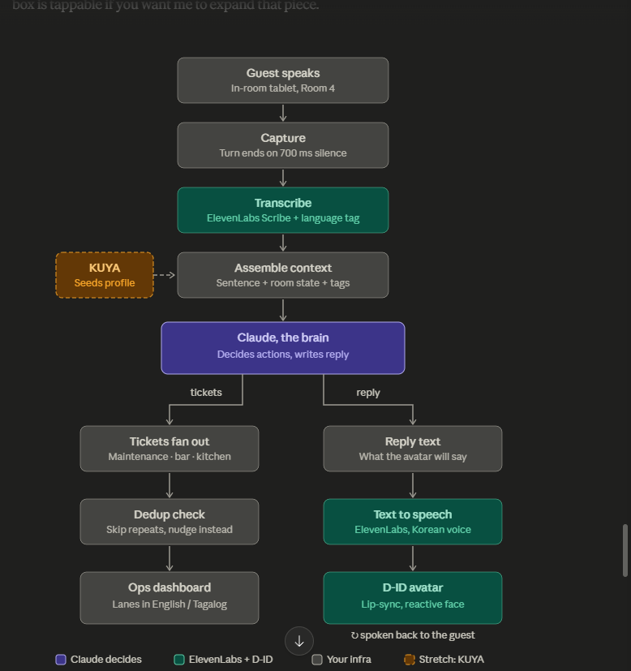

# Big Bros White Sand Room Host

An in-room tablet voice agent for Big Bros White Sand resort (Zambales). A guest
speaks one messy sentence; the host (a reactive D-ID avatar) replies in voice in
the guest's own language, and the same sentence is decomposed into structured
tickets routed to the right department lanes on a staff dashboard.

Built for an ElevenLabs x D-ID hackathon, intended to actually ship for the
resort's Summer opening.

Repo: https://github.com/reddxmanager/bigbros-roomhost

## How it works

```
mic tap -> capture one clip -> Scribe (text + language)
        -> Claude (one tool-calling turn: spoken reply + ticket calls)
        -> tickets fan out over websocket to department lanes
        -> reply -> ElevenLabs TTS in the guest's language -> D-ID lip-sync
```



The brain is Claude, in our backend, so routing is ours and visible. D-ID is the
face and mouth only. The detected language tag from Scribe drives the reply
language end to end, so a guest can speak Tagalog or Korean and the avatar
answers in kind while the kitchen ticket still lands in English.

## Two surfaces

- **Guest tablet** at `/tablet` (per-room, e.g. `/tablet?room=4`). Warm,
  avatar-led, push-to-talk. Tap the host to speak: the mic opens for one
  capture, auto-stops on silence, and closes immediately. Privacy by design,
  the mic is never live outside a deliberate tap.
- **Staff dashboard** at `/`. Calm, websocket-fed ticket lanes (kitchen, bar,
  housekeeping, maintenance, frontdesk) with a single ticket-lands transition.

## Running the demo

With both servers up (see below), open these in the browser:

| URL | What it is |
|---|---|
| `http://localhost:5173/` | Staff dashboard. Keep it on a second screen to watch tickets land live. |
| `http://localhost:5173/tablet?room=4` | Guest tablet, Family Suite (allergy/kids persona). |
| `http://localhost:5173/tablet?room=4&lang=ko` | Same tablet, staged to open the Korean showcase. |

Tap the host to wake it, tap again to speak. The avatar replies in whatever
language the guest speaks (English default; try Tagalog or Korean), and the
tickets still land in English on the dashboard. The English/한국어 toggle in the
tablet header switches the reply language for the staged Korean take.

## Stack

- **Backend:** FastAPI, Anthropic SDK (Claude), ElevenLabs (Scribe STT + TTS),
  D-ID V4 streaming agent, websocket to the dashboard.
- **Frontend:** Vite + React + TypeScript, Phosphor icons, installable PWA.

## Running it locally

### 1. Backend

```bash
cd backend
python -m venv .venv && . .venv/Scripts/activate   # Windows; use .venv/bin/activate on macOS/Linux
pip install -r requirements.txt
cp .env.example .env                                # then fill in the keys (see below)
uvicorn app.main:app --reload --port 8000
```

The server boots on `http://localhost:8000`. It requires `ANTHROPIC_API_KEY` to
start. To run without it during development, use the mocked brain:

```bash
BIGBROS_USE_MOCK_BRAIN=1 uvicorn app.main:app --reload --port 8000
```

The ElevenLabs and D-ID services are built lazily on first tablet use, so a
dashboard-only or mocked-brain run never needs those keys.

### 2. Frontend

```bash
cd frontend
npm install
npm run dev
```

Open `http://localhost:5173` for the staff dashboard, or
`http://localhost:5173/tablet?room=4` for the guest tablet. The Vite dev server
proxies the API and websocket to the backend on port 8000.

## Environment variables

Set these in `backend/.env` (gitignored). See `backend/.env.example`.

| Variable | Needed for | Notes |
|---|---|---|
| `ANTHROPIC_API_KEY` | The Claude brain | Required at boot. Skip with `BIGBROS_USE_MOCK_BRAIN=1`. |
| `ELEVENLABS_API_KEY` | Scribe STT and TTS | Lazy, on first tablet use. |
| `ELEVENLABS_VOICE_ID` | TTS voice | Lazy, on first tablet use. |
| `DID_API_KEY` | D-ID streaming avatar | Lazy, on first tablet use. |
| `DID_AVATAR_IMAGE_URL` | Presenter image | Optional. Falls back to a D-ID default. |

## Tests

The brain harness exercises the five core triage cases (multi-intent split,
ambiguous routing, complaint with refund demand, cancel, and repeat-within-dedup):

```bash
cd backend
python scripts/test_brain.py
```

## Repo layout

```
backend/
  app/
    main.py            FastAPI entry, tablet + dashboard endpoints
    pipeline.py        capture -> brain -> tickets -> broadcast
    schema.py          the uniform Ticket shape, shared by every lane
    store.py           room state + ticket store + websocket fan-out
    services/          brain (Claude), stt (Scribe), tts, avatar (D-ID)
  scripts/test_brain.py
frontend/
  src/
    components/        Tablet (guest), Dashboard + TicketCard (staff)
    lib/               did (WebRTC client), api, ws, types
big-bros-voice-agent-spec.md   the source of truth
CLAUDE.md                      guidance for working in this repo
```

## Design notes

The full design, the locked architecture decisions, the brain tools and
invariants (no fake ETA, allergy auto-tag, no silent misroutes, dedup, careful
escalation), and the build order all live in `big-bros-voice-agent-spec.md`.
That spec is the source of truth.
